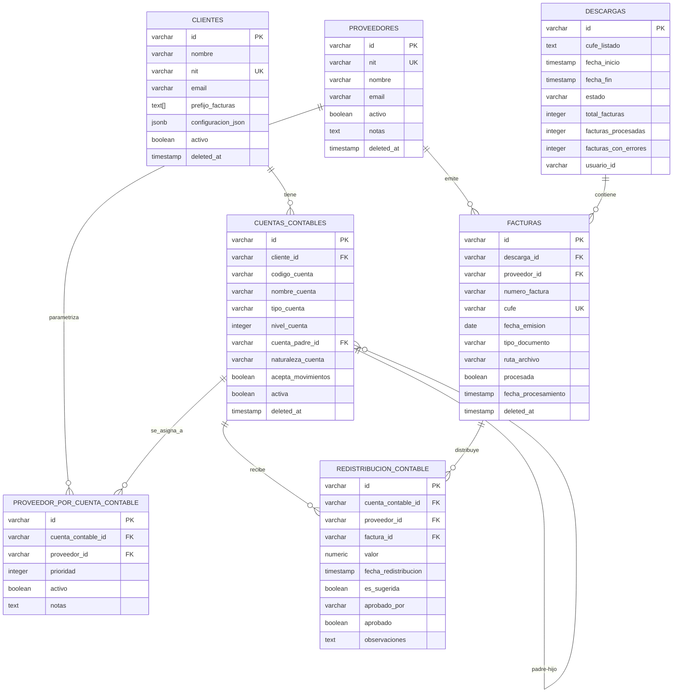

# Diagrama de Estructura de Base de Datos - FormalizeSE Hub

## Resumen Visual de Tablas y Relaciones



## Flujo de Datos Principal

```
┌─────────────────────────────────────────────────────────────────┐
│                    INTEGRACIÓN CON DIAN                         │
│                                                                  │
│  1. Descarga de Facturas Electrónicas ──► DESCARGAS (tabla)    │
│     - Autenticación con token_dian                              │
│     - Descarga masiva por rango de fechas                       │
│     - Almacenamiento de XMLs en directorio                      │
└────────────────────────┬────────────────────────────────────────┘
                         │
                         ▼
┌─────────────────────────────────────────────────────────────────┐
│                  PROCESAMIENTO DE FACTURAS                       │
│                                                                  │
│  2. Extracción y Registro ──► FACTURAS (tabla)                 │
│     - Lectura del CUFE (único por factura)                      │
│     - Identificación del PROVEEDOR                              │
│     - Almacenamiento de ruta del archivo                        │
└────────────────────────┬────────────────────────────────────────┘
                         │
                         ▼
┌─────────────────────────────────────────────────────────────────┐
│              SUGERENCIA DE CONTABILIZACIÓN                       │
│                                                                  │
│  3. Sistema busca en PROVEEDOR_POR_CUENTA_CONTABLE              │
│     - Obtiene cuentas parametrizadas por prioridad              │
│     - Crea redistribuciones con es_sugerida = true              │
│     - Estado inicial: aprobado = false                          │
└────────────────────────┬────────────────────────────────────────┘
                         │
                         ▼
┌─────────────────────────────────────────────────────────────────┐
│                   APROBACIÓN CONTABLE                            │
│                                                                  │
│  4. Contador revisa REDISTRIBUCION_CONTABLE                     │
│     - Valida cuentas sugeridas                                  │
│     - Puede modificar o agregar redistribuciones                │
│     - Aprueba: aprobado = true, aprobado_por = usuario          │
│                                                                  │
│  5. Cuando todas las redistribuciones están aprobadas:          │
│     ──► Trigger actualiza FACTURA.procesada = true              │
└─────────────────────────────────────────────────────────────────┘
```

## Jerarquía del Plan Contable (PUC)

```
NIVEL 1: CLASE
│
├─ 1 - ACTIVO
│  │
│  └─ NIVEL 2: GRUPO
│     │
│     ├─ 11 - DISPONIBLE
│     │  │
│     │  └─ NIVEL 3: CUENTA
│     │     │
│     │     ├─ 1105 - CAJA
│     │     │  │
│     │     │  └─ NIVEL 4: SUBCUENTA (acepta movimientos)
│     │     │     │
│     │     │     └─ 110505 - CAJA GENERAL ✓ [PUEDE RECIBIR REDISTRIBUCIONES]
│     │     │
│     │     └─ 1110 - BANCOS
│     │        │
│     │        └─ 111005 - BANCO PRINCIPAL ✓
│     │
│     └─ 12 - INVERSIONES
│        └─ ...
│
├─ 2 - PASIVO
│  └─ ...
│
├─ 3 - PATRIMONIO
│  └─ ...
│
├─ 4 - INGRESOS
│  └─ ...
│
├─ 5 - GASTOS
│  │
│  └─ 51 - GASTOS OPERACIONALES DE ADMINISTRACION
│     │
│     └─ 5101 - GASTOS DE PERSONAL
│        │
│        ├─ 510506 - HONORARIOS ✓ [PUEDE RECIBIR REDISTRIBUCIONES]
│        └─ 510515 - SERVICIOS ✓ [PUEDE RECIBIR REDISTRIBUCIONES]
│
└─ 6 - COSTOS
   └─ ...
```

## Conceptos Clave

### 1. **CUFE** (Código Único de Facturación Electrónica)

- Identificador único de cada factura electrónica en Colombia
- Generado por la DIAN
- Es como el "serial number" de la factura
- Campo UNIQUE en la base de datos

### 2. **Parametrización de Proveedores**

- Cada proveedor puede tener múltiples cuentas parametrizadas
- La **prioridad** determina cuál cuenta sugerir primero (1 = mayor prioridad)
- Permite automatización: Sistema sugiere la cuenta basándose en parametrización

### 3. **Redistribución Contable**

- Una factura puede distribuirse en múltiples cuentas contables
- Ejemplo: Factura de $1,000,000
  - $600,000 ──► Cuenta 510506 (Honorarios)
  - $400,000 ──► Cuenta 510515 (Servicios)
- Requiere aprobación de contador

### 4. **Flujo de Aprobación**

- `es_sugerida`: Indica si el sistema la creó automáticamente
- `aprobado`: Indica si un contador la validó
- `aprobado_por`: Usuario/contador que aprobó
- **Trigger automático**: Cuando todas las redistribuciones de una factura están aprobadas, marca la factura como procesada

### 5. **Plan Contable Jerárquico**

- Estructura de árbol con niveles
- Solo las cuentas auxiliares (nivel más profundo) aceptan movimientos
- `cuenta_padre_id`: Permite navegación jerárquica
- Función `obtener_ruta_cuenta()` obtiene la ruta completa

## Índices y Optimizaciones

### Índices Críticos

- `facturas.cufe` - UNIQUE, búsquedas rápidas
- `facturas.procesada` - Filtros frecuentes
- `cuentas_contables.acepta_movimientos` - Validaciones
- `redistribucion_contable.aprobado` - Búsquedas de pendientes
- `clientes.configuracion_json` - GIN index para búsquedas en JSON

### Triggers Automáticos

1. **update_updated_at_column**: Actualiza `updated_at` en todos los UPDATE
2. **marcar_factura_procesada**: Marca factura como procesada cuando todas sus redistribuciones están aprobadas
3. **validar_cuenta_acepta_movimientos**: Valida que solo cuentas auxiliares reciban redistribuciones

## Vistas Útiles

| Vista                                | Propósito                                     |
| ------------------------------------ | --------------------------------------------- |
| `v_facturas_detalle`                 | Facturas con proveedor y descarga             |
| `v_redistribuciones_detalle`         | Redistribuciones con toda la info relacionada |
| `v_proveedores_cuentas`              | Proveedores con sus cuentas parametrizadas    |
| `v_plan_contable_jerarquico`         | PUC con estructura de árbol completa          |
| `v_resumen_descargas`                | Estadísticas de descargas de DIAN             |
| `v_balance_por_cuenta`               | Balance y movimientos por cuenta              |
| `v_facturas_pendientes_contabilizar` | Facturas sin procesar                         |

## Funciones Útiles

```sql
-- Sugerir cuenta para un proveedor
SELECT * FROM sugerir_cuenta_para_proveedor('proveedor-001');

-- Obtener ruta jerárquica de una cuenta
SELECT obtener_ruta_cuenta('cuenta-012');
-- Resultado: "5 > 51 > 5101 > 510506"
```

## Tipos de Datos Especiales

### Arrays PostgreSQL

```sql
-- prefijo_facturas es un array
INSERT INTO clientes (..., prefijo_facturas, ...)
VALUES (..., ARRAY['FV', 'NC', 'ND'], ...);

-- Buscar cliente por prefijo
SELECT * FROM clientes WHERE 'FV' = ANY(prefijo_facturas);
```

### JSONB

```sql
-- configuracion_json permite datos flexibles
INSERT INTO clientes (..., configuracion_json, ...)
VALUES (..., '{"razon_social": "Mi Empresa", "regimen": "COMUN"}'::jsonb, ...);

-- Buscar por campo JSON
SELECT * FROM clientes WHERE configuracion_json->>'regimen' = 'COMUN';
```

## Notas Importantes para Desarrollo

1. **Soft Delete**: Todas las tablas principales tienen `deleted_at`
2. **Foreign Keys**: Usar `ON DELETE RESTRICT` en relaciones críticas
3. **Validaciones**: Los constraints SQL evitan datos inconsistentes
4. **Timestamps**: `created_at` y `updated_at` automáticos
5. **Integridad Referencial**: No se pueden eliminar proveedores con facturas asociadas
